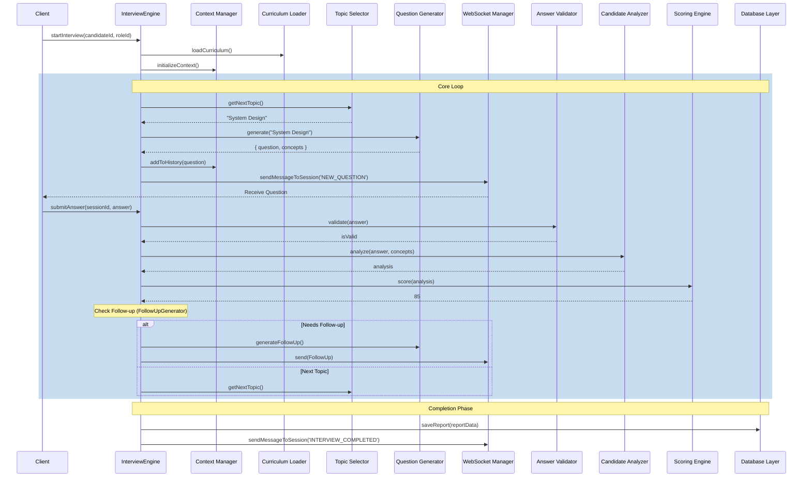

# InterviewEngine Orchestration Flow

```mermaid
sequenceDiagram
    participant Client
    participant Engine as InterviewEngine
    participant Context as Context Manager
    participant Curriculum as Curriculum Loader
    participant Topic as Topic Selector
    participant QGen as Question Generator
    participant WS as WebSocket Manager
    participant Validator as Answer Validator
    participant Analyzer as Candidate Analyzer
    participant Score as Scoring Engine
    participant DB as Database Layer

    Client->>Engine: startInterview(candidateId, roleId)
    Engine->>Curriculum: loadCurriculum()
    Engine->>Context: initializeContext()
    
    rect rgb(200, 220, 240)
        Note over Engine, DB: Core Loop
        Engine->>Topic: getNextTopic()
        Topic-->>Engine: "System Design"
        Engine->>QGen: generate("System Design")
        QGen-->>Engine: { question, concepts }
        Engine->>Context: addToHistory(question)
        Engine->>WS: sendMessageToSession('NEW_QUESTION')
        WS-->>Client: Receive Question
        
        Client->>Engine: submitAnswer(sessionId, answer)
        Engine->>Validator: validate(answer)
        Validator-->>Engine: isValid
        Engine->>Analyzer: analyze(answer, concepts)
        Analyzer-->>Engine: analysis
        Engine->>Score: score(analysis)
        Score-->>Engine: 85
        
        Note over Engine: Check Follow-up (FollowUpGenerator)
        alt Needs Follow-up
            Engine->>QGen: generateFollowUp()
            Engine->>WS: send(FollowUp)
        else Next Topic
            Engine->>Topic: getNextTopic()
        end
    end
    
    Note over Engine, DB: Completion Phase
    Engine->>DB: saveReport(reportData)
    Engine->>WS: sendMessageToSession('INTERVIEW_COMPLETED')
```
